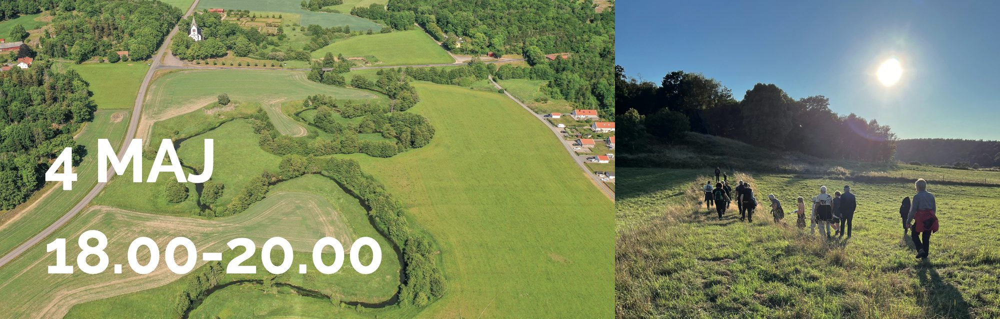

**Hos Helena och Björn Karlsson, Sjögärdevägen 81 (439 63 Frillesås) den 4 maj klockan 18.**

**Kvällens agenda:**

**18.00-19.00**

Hej och välkommen!

Vi startar kvällen med en presentation av **HG Karlsson,** naturvårdsguide från Länsstyrelsen kommer och berättar om **Tjolöholms. nya naturreservat** som invigs 31 maj.

***Unikt område som lockar tusentals!***

Det fantastiskt natursköna området runt Tjolöholms slott vid Kungsbacka-fjorden är ett av de mest värdefulla skogsområdena i Hallands län. Här möts natur, kultur och friluftsliv och skapar ett besöksmål för alla. Området har präglats av adeln sedan 1200-talet och landskapet runt slottet andas herrgårdsmiljö med stora fält omväxlat med skogsklädda berg. Framför allt består det nya naturreservatet av ädellövskog men även av hällmarker, hagmarker, blommande bryn och betade havsstrandängar. Missa inte att få mer information om denna pärla!

**19.00 -20.00**

Vi fortsätter med föreningens Årsmöte.

Välkommen till gamla och nya medlemmar.
