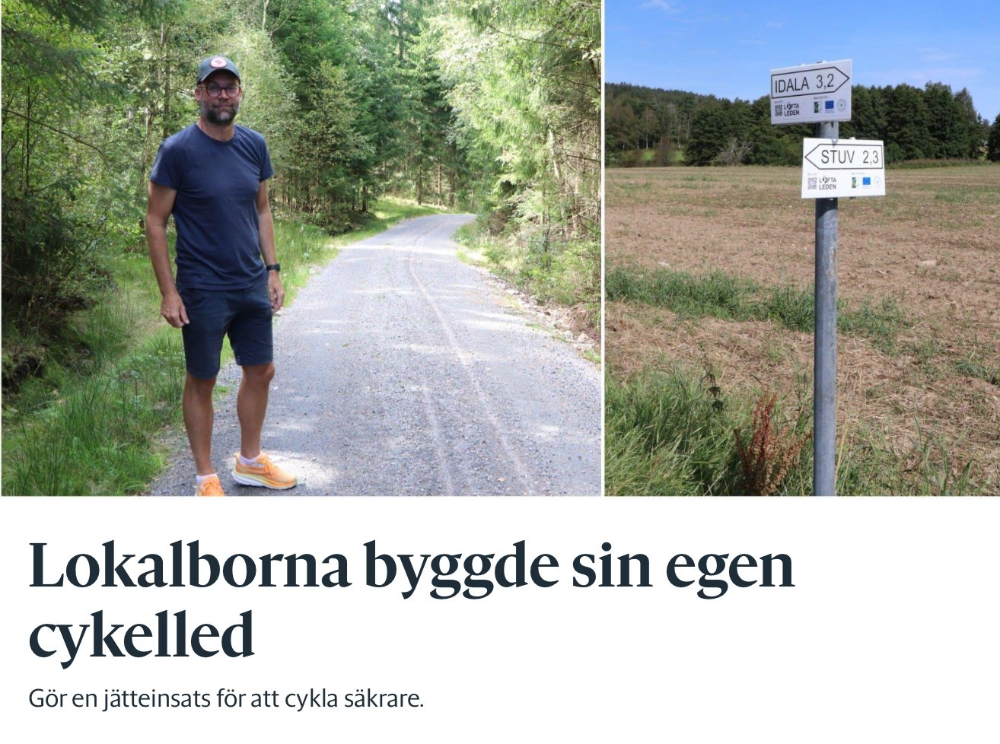

Idag var Kungsbackapostens Marie Larsson på besök i Löftadalen. Kul med besök från stan. Tack Marie! Hon skriver i sin artikel:

> Den nya leden ska ge cyklister och fotgängare en tryggare och roligare väg att transportera sig på runt Frillesås och Idala.

> Löftaleden är ett ideellt projekt som också är finansierat av EU-pengar, men drivs av personer som vill skapa gemenskap och trygghet.

> – Infrastruktur är ju det som knyter ihop människor...

Läs hela artikeln här:

[https://www.kungsbackaposten.se/nyheter/ny-cykelled-byggs-pa-initiativ-av-lokalborna-bra-ide.40328477-7947-4998-83dd-c08d5e85e7dc](https://www.kungsbackaposten.se/nyheter/ny-cykelled-byggs-pa-initiativ-av-lokalborna-bra-ide.40328477-7947-4998-83dd-c08d5e85e7dc)
