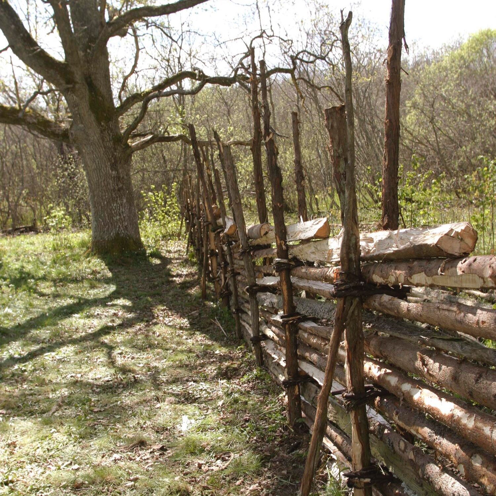

#### Nu på söndagen den 15:e september klockan 13 har ni möjlighet att förverkliga era drömmar om en riktig småländsk gärdesgård - och dessutom bygga den själv! Wow!

**När:** 15 september, 13.00

**Var:** Slättaråsbacken 21, Frillesås

**Hur:** Kom arbetsklädd med handskar, övrigt material finns på plats

En småländsk gärdesgård är en traditionell typ av staket som används i Småland och andra delar av Sverige för att avgränsa betesmarker och åkrar. Gärdesgårdar byggs vanligtvis av trä, oftast gran, och har en karakteristisk flätad eller korslagd struktur. Riktigt fint också i Löftadalens landskap. Konstruktionens flexibilitet kan följa markens naturliga lutningar och ojämnheter.

Stolparna som används kallas ofta för “störar”, och mellan dem fästs slanor, som ligger i diagonala mönster för att skapa ett starkt och flexibelt staket. Denna typ av gärdesgård har använts i århundraden och är en viktig del av det svenska kulturlandskapet, särskilt på landsbygden. Gärdesgården är funktionell och enkel att reparera, samtidigt som den ofta anses vara vacker och traditionell.

Att du behöver göra är att mejla ditt intresse till [magnus.falk@iogt.se](mailto:magnus.falk@iogt.se) och dyka upp med oömma kläder och arbetshandskar.

Löftaledens alldeles egna Magnus - som på alla sätt är en riktig smålänning - guider er i hantverket.

Är du mer nyfiken redan innan träffen finns en bra introduktion på [Sydveds sida](https://www.sydved.se/aktuellt/inspiration/hem-och-tradgard/sa-bygger-du-en-traditionell-gardsgarden).
