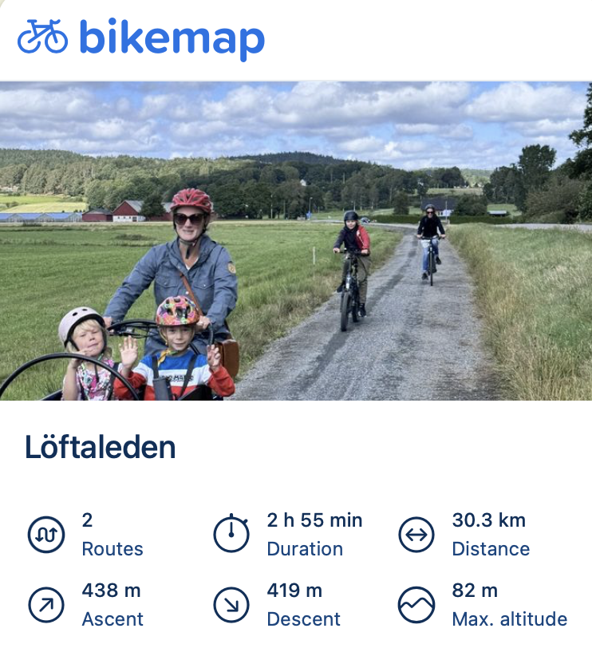
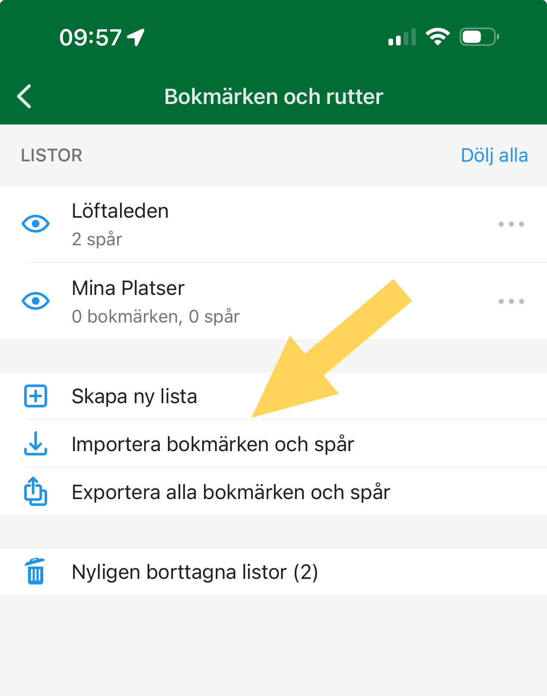

**Nu blir det enklare än någonsin att hitta rätt på Löftaleden. Förutom vår karta på Google Maps kan du nu använda både Bikemap och Organic Maps – med stöd för navigering och GPX-filer direkt i mobilen.**

### Google Maps

Många av er har redan använt [vår karta på](https://www.google.com/maps/d/viewer?mid=1VkNuRYBaa4m3dAltQ5wxEULHtuvZph4&usp=sharin)[**Google Maps**](https://www.google.com/maps/d/viewer?mid=1VkNuRYBaa4m3dAltQ5wxEULHtuvZph4&usp=sharin) – den har funnits med länge och är enkel och bekant. Perfekt om man bara vill få en snabb överblick över leden eller hitta startpunkten.

### Bikemap (iOS & Android)

Bikemap är lite av ett community i sig. Här kan du dela dina egna rutter, se vad andra gjort och inspireras av andras turer. Grundversionen är gratis och räcker långt för enkel navigering, men om du vill använda offlinekartor, mer användarvänlig navigering, exportera GPX-filer eller prova olika kartstilar som 3D-vy eller nattläge, behöver du betalversionen.

Bikemap samlar mycket information tack vare sitt stora användarnätverk – men tänk på att du får mer reklam och datainsamling i gratisversionen. Betalversionen ger en renare och bättre upplevelse. [Löftaleden på Bikemap](https://www.bikemap.net/en/c/438072/)

### Organic Maps (iOS & Android mfl.)

Organic Maps är raka motsatsen på flera sätt. Appen är helt gratis, har inga premium-lås, ingen reklam och ingen spårning. Allt du behöver fungerar även offline - du laddar ner kartorna, och sen kan du använda navigering, sök och GPX-filer utan internetuppkoppling.

Här finns inget community som i Bikemap. I stället bygger Organic Maps på **OpenStreetMap**, vilket betyder att alla som vill kan bidra med att förbättra rutter, terrängen eller platserna direkt i kartunderlaget. Du delar inte rutter inne i appen, utan genom att exportera GPX-filer och skicka dem till andra via mejl eller molntjänster. Det gör Organic Maps särskilt bra för den som värderar enkelhet, integritet och pålitlighet framför “flashiga” kartstilar.

Du hitta länkar till Organic Maps appar på [deras hemsida](https://organicmaps.app/). Sedan importerar du Löftaleden GPX-fil under menyn Bokmärken och rutter (se bild ).

### I korthet:

- **Google Maps** - det snabba och enkla alternativet för en överblick.
- **Bikemap** - för den som vill ha ett community, fler kartstilar och funktioner (men mycket låst till Premium).
- **Organic Maps** - för den som vill ha gratis, helt offline och reklamfritt, med full kontroll över sina egna GPX-filer.

**Vi hoppas att dessa alternativ gör din vandring eller cykling längs Löftaleden både enklare och roligare - och att du hittar det verktyg som passar just dig bäst!**
